# Google Marketplace deployment guide

## Before deploying
The following pre-requisities must be fulfilled to deploy Tranquility Base from Marketplace:
- An Organisation must be available

- You must hold the owner role on the Folder (or Organisation) where the Tranquility Base resource
 hierarchy will be created

- An initial configuration must exist (see below)

## Create initial configuration
You have to create an initial configuration before deploying Tranquility Base. 
Follow the following instructions to do so:

### 1.Open Cloud Shell 
From the GCP console open the Cloud Shell:
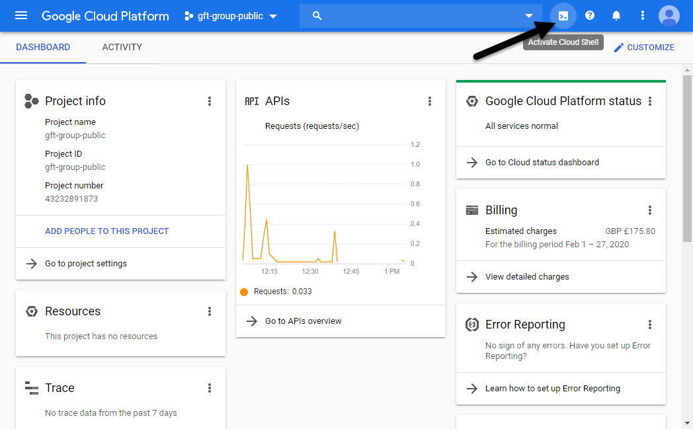

### 2.Download script 
Download the configurator script hosted in Github by running the following command:
```
wget https://raw.githubusercontent.com/tranquilitybase-io/tb-gcp/master/tb-marketplace/tb-config-creator/tb-config-creator
```

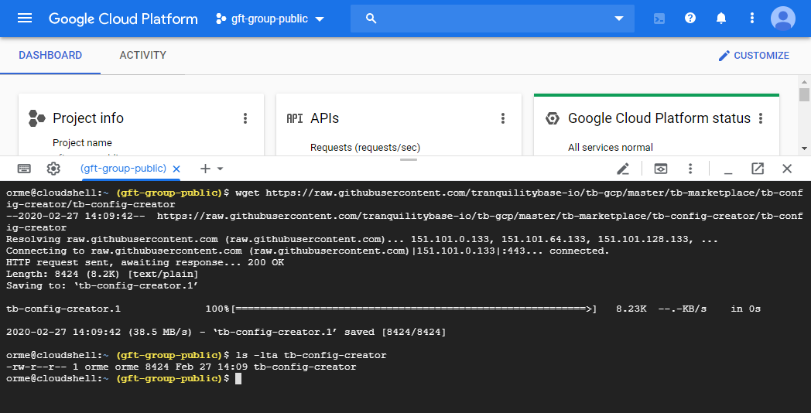

### 3.Grant permissions
Grant the script with execution permissions by running the following command:
```
$ chmod +x tb-config-creator
```
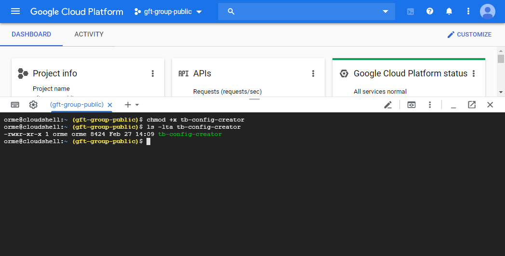

### 4.Execute script
#### Print help
If you execute the script without any parameter, a help message will be displayed. This message informs about two things:
1. The need to run the script with elevatd permissions
2. The parameters required to run the script (Folder ID and Billing Account are required)


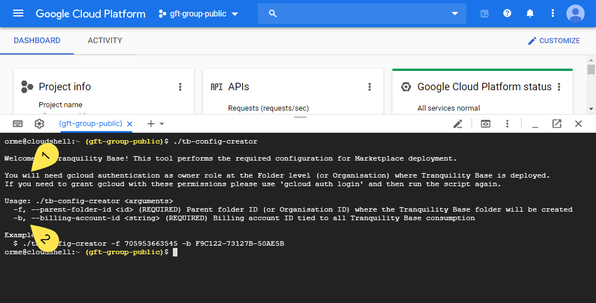

#### Run configuration
Then run the script with proper Folder ID and Billing Account. E.g.,
```
$ ./tb-config-creator -f 705953663545 -b F9C122-73127B-50AE5B
```
The script verifies that both are valid entries 
(it will fail if you have no permissions into them both) and then it lists the configuration that is about to be created.

You'll be prompted to continue the configuratioen:

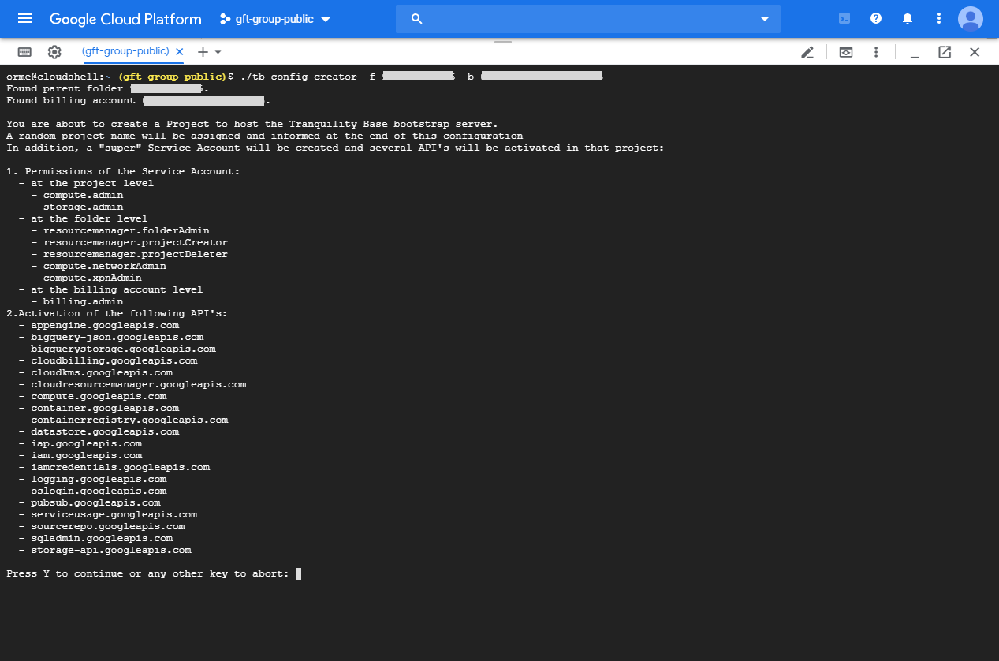

#### Confirm execution 
At confirmation, the steps of the configuration are triggered sequentially. 

At the end of the process the script outputs the name of the project created (in this example'bootstrap-tb-011f7b'). 

Configuration is completed and the deployment in Marketplace can be done now!


## Deployment on Google Marketplace
Follow the following steps now to deploy Tranquility Base from Marketplace.

### 1.Change project
Use the drop-down tool to find and select the project created in the configuration earlier.

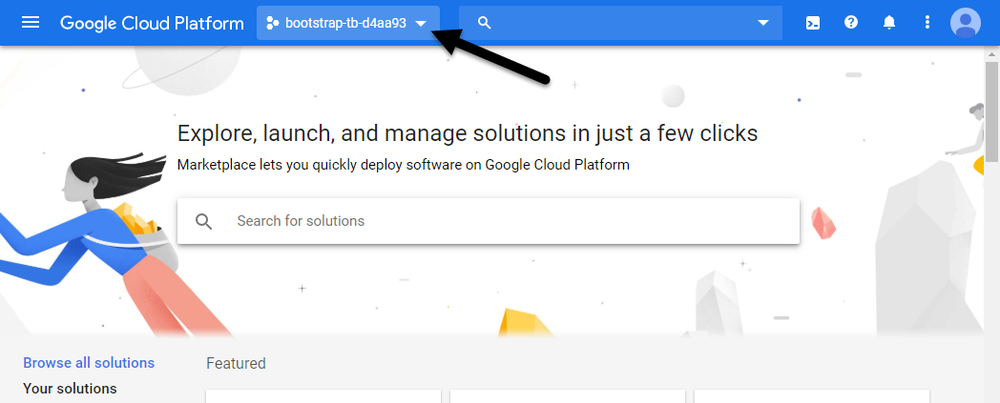

### 2.Search solution
Type Tranquility Base in the search box to retrieve our solution. 

(**Temporary screenshot to be updated once TB is live**)

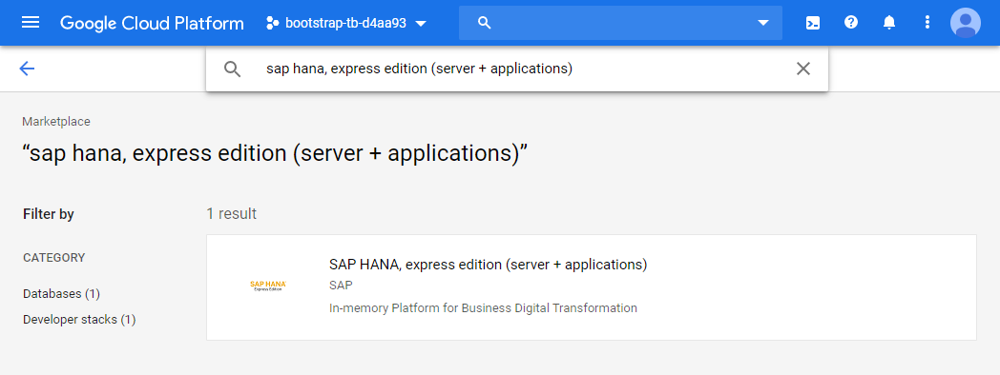

### 3.Launch solution
Just go and click Launch!

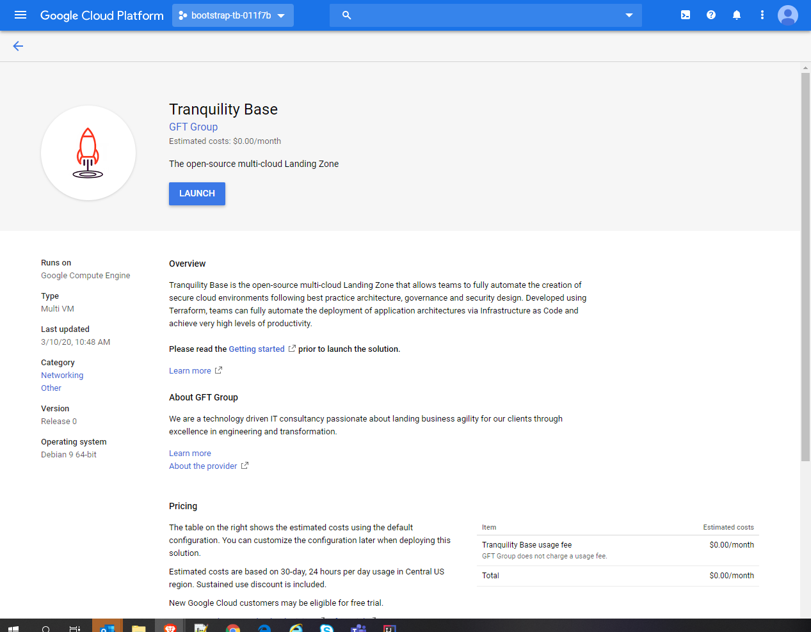

### 4.Deploy solution
#### Before...
Now adjust the Deployment name and Zone to your preferences and fill in the fields Folder ID and Billing Account prior 
to click Deploy.

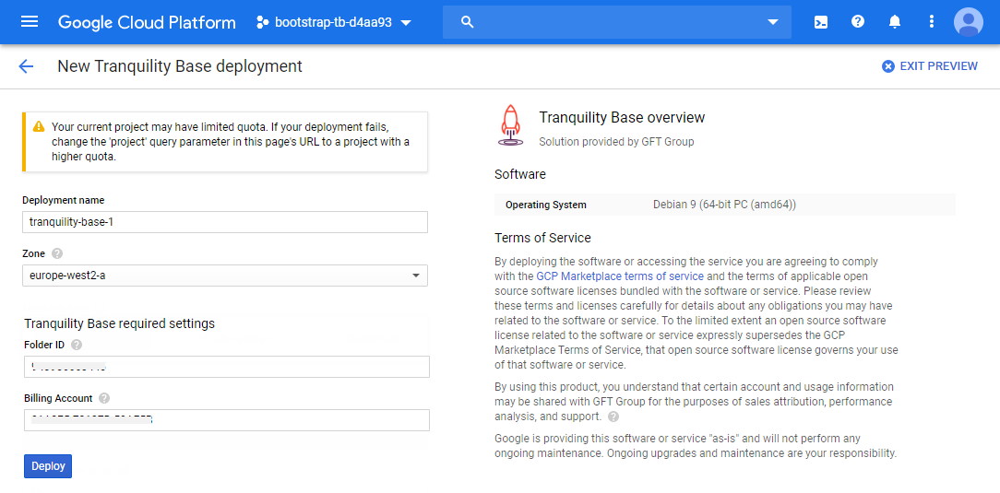

#### During...
The screen shows the progress of the deployment. This shouldn't take longer than a couple of minutes.

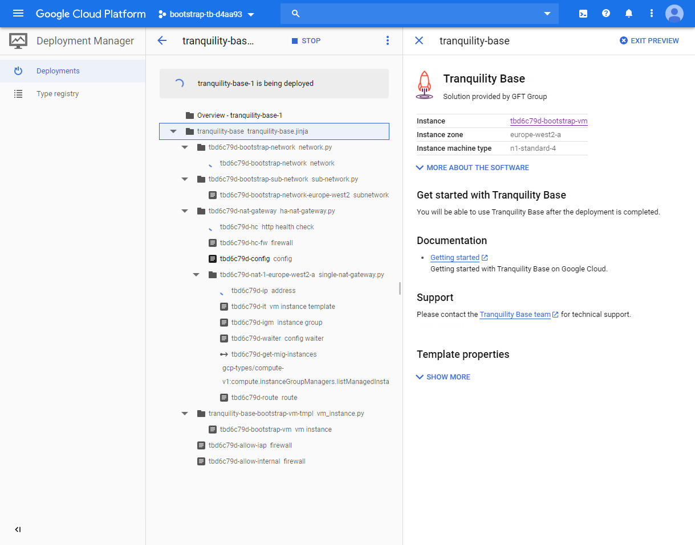

#### After...
Upon deployment completion, the section next steps informs of how you can:
- open an SSH connection into the the Tranquility Base bootstrap server (called 'tb011f7b-bootstrap-vm' in the example) 
that has just been deployed. (The basic Landing Zone is being deployed from this server using Terraform code and it may 
take up to **15 mins** to finish.)

- connect into the Eagle Console to choose some deployment options and complete the Landing Zone deployment


## Verify the deployment
Open the project selection screen and verify that the Tranquility Base folder has been created under the folder of your 
choice ("Modern Applications" in our case). Under the Tranquility Base folder, two folders will have been created: Applications
 and Shared Services. Under Shared Services there are a number of basic shared projects created. Applications folder will
 show empty by now.

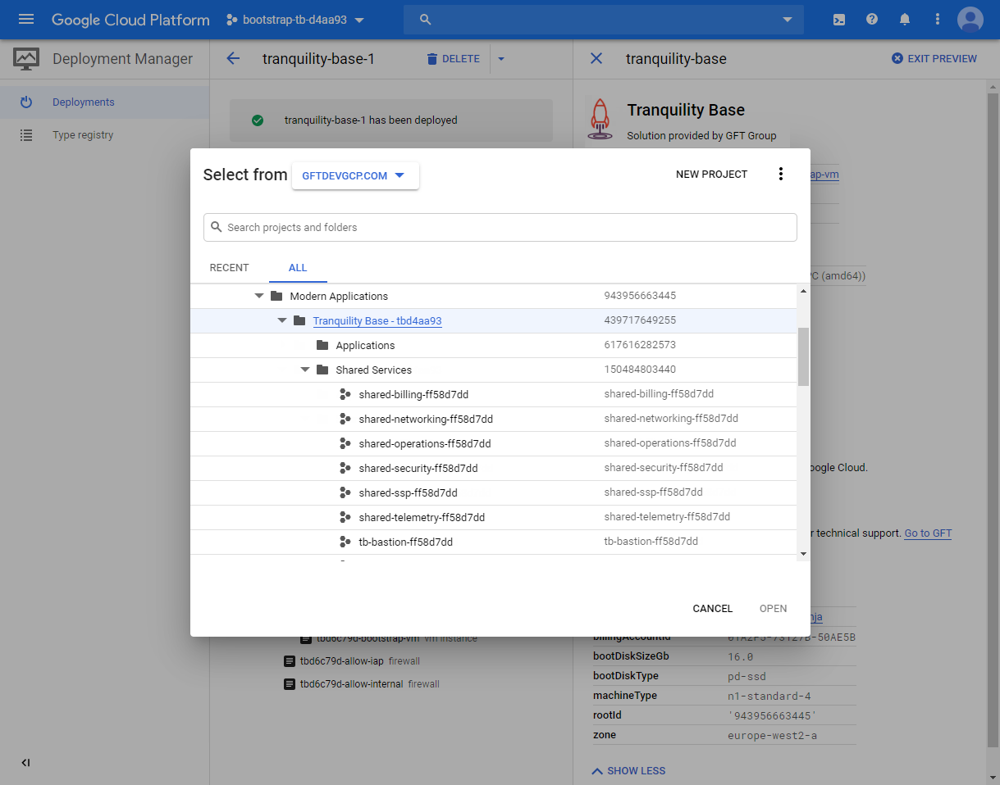

Well done, you have deployed Tranquility Base in your Organisation!